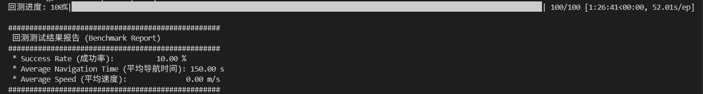
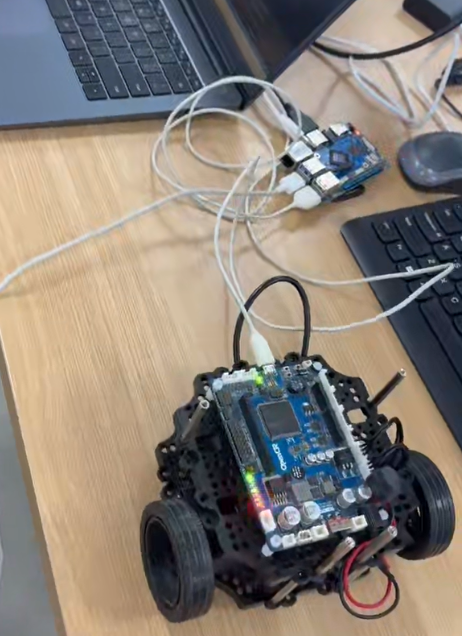

# Weekly Progress Log

> Update this file **every week**. Add a new entry at the top for each week.
> This is the first thing we check during review. Keep it honest and specific — it also feeds your attendance record (Rule 1).

**How to use:** copy the *Week template* block below for each new week. Newest week goes at the top.

---

## Week template — copy me

### Week N — YYYY-MM-DD

**Attended this week's meeting:** Yes / No (if No, did you email leave? Yes / No)

**Progress this week**
- _What did you actually do / finish?_

**Challenges & blockers**
- _What got in the way? What are you stuck on?_

**Next steps**
- _What will you do next week?_

**Hours spent (optional):** _e.g. 6h_

**Links (optional):** _commits, notebooks, docs, datasets..._

---

<!-- =================  YOUR ENTRIES BELOW  ================= -->

### Week 1 — 2026-06-17

**Attended this week's meeting:** Yes

**Progress this week**
- Set up repository from the FURP template.
- Paper reading for VLN & RL Navigation

**Challenges & blockers**
- No cuda environment & linux os

**Next steps**
- CUDA environment: Work with team / in lab

### Week 2 — 2026-06-24

**Attended this week's meeting:** Yes

**Progress this week**
- Setup ir-sim simulation environment
- NeuPAN baseline reproduction and complex scene testing
- Paper reading for feature and problem of RL Navigation

**Challenges & blockers**
- No exact testing data in the paper
- 3D simulation environment is hard to setup

**Next steps**
- Try RL training steps and 3D simulation environment setup

**Hours spent (optional):**

**Links (optional):**

### Week 3 — 2026-06-30

**Attended this week's meeting:** Yes

**Progress this week**
- Complete the assembly of the robot
- Install the required dependencies and perform firmware burning
- Real testing of NeuPAN navigation algorithm

**Challenges & blockers**
- The official tutorial is only available for the ROS1
- Lack of various parts

**Next steps**
- Try to create some structure and test

**Hours spent (optional):**

**Links (optional):**

